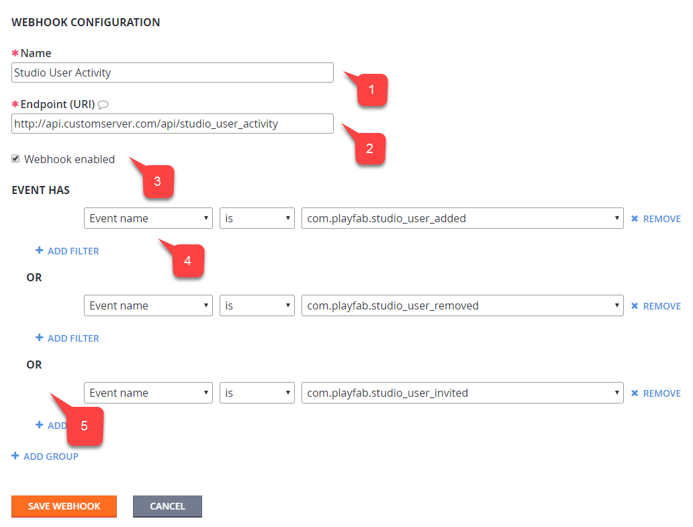

# Webhooks

In complex systems, you may want to provide additional event handling on your custom server. To achieve this, PlayFab offers Webhooks.

Whenever a new event is emitted, it can be forwarded to your server by making a POST request to your custom web endpoint. The event data is then passed as the JSON body of the request.

> [!IMPORTANT]
> Entity API calls do not currently support forwarding with Webhooks.

## Accessing Webhooks

To access the **Webhooks** panel in the PlayFab **Game Manager** screen:

1. Select **Analytics** in the sidebar menu.
2. Then choose the **Webhooks** tab.

  

## Overview of the Webhooks panel

The image shown below provides an overview of the **Webhooks** panel.

1. The **New Webhook** button allows you to create and configure a new Webhook.
2. The **Webhook Name** area can be used to access and configure the Webhook.
3. The **Status** area shows whether a Webhook is currently **enabled**.
4. The **Failing Since** area shows when a Webhook endpoint stopped returning **OK** responses.
5. When one or more Webhooks are selected, you can use the **Delete** button to permanently remove them.

  

## Configuring a Webhook

The image shown below describes the options for configuring a Webhook.

1. Use the **Name** field to create a Webhook name that will uniquely identify the Webhook.
2. Set up the **Endpoint URI**. This **URI** will be hit when the **Event** occurs.
3. You may set the **Webhook** as **Enabled** - **true** or **false**. This allows you to temporarily suspend a Webhook without completely removing (deleting) it from the system.
4. Set up the **Filters** to only process the **Events** you need. You can filter by **Event Name**, **Event Source**, and **PlayerID**.

> [!NOTE]
> You can have several **Filters** per **Group**, but each **Filter** setting must be matched for the event to fall into the **Filter Group**.

5. You may define several **Filter Groups** to include different filters. **Events** must fall into at least *one* group to be passed to the Webhook.

  
