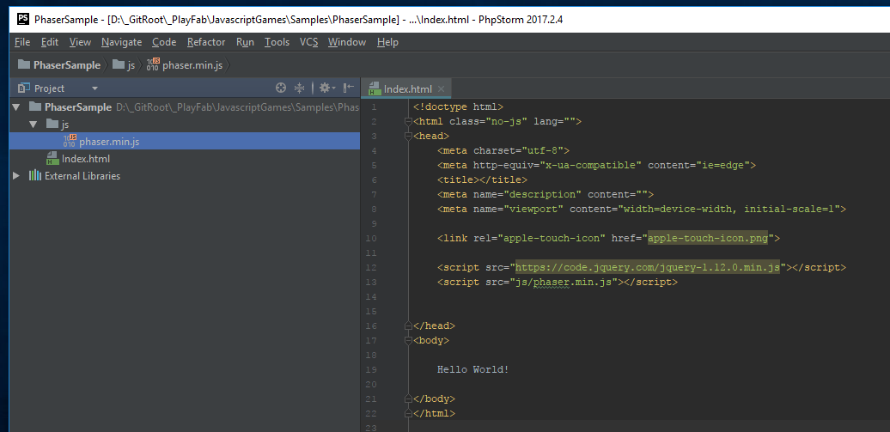
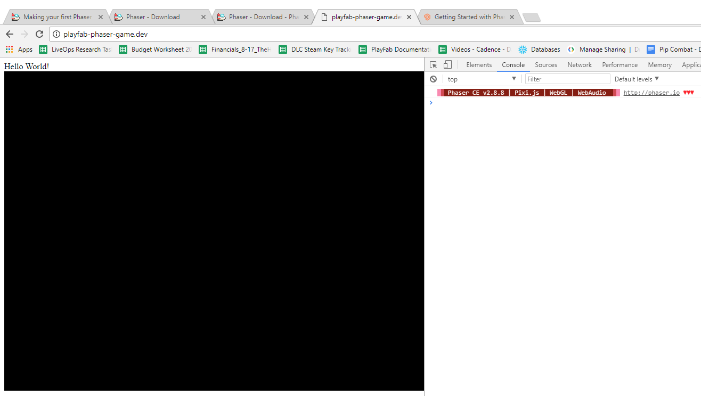

# Setting up PlayFab authentication in Phaser.io

[Phaser.io](https://phaser.io/) is a desktop and mobile HTML5 game framework that PlayFab now supports in our Javascript SDK.

Phaser.io supports plugins, so we at PlayFab thought that it would be useful for the Phaser.io community to have a powerful back end system that works as a plugin to the Phaser.io engine.

This tutorial guides you through the procedure for setting up Phaser.io, and getting started with PlayFab within Phaser.io.

## Requirements

- Knowledge of JavaScript.
- Knowledge of setting up a web server.
- General understanding of Phaser.io (a plus!).

## Setting up a web server using MAMP

To serve HTML pages to your browser, you will need a web server. We use [MAMP/MAMP Pro](https://www.mamp.info/en/), but you can use whatever you are most comfortable with.

To begin:

- Set up a website via Mamp/Mamp Pro, or your webserver of choice.
- Create an **Index.html** file in the root of your website folder.

> [!NOTE]
> Alternately, you can refer to the [Running an HTTP server for testing](running-an-http-server-for-testing.md) tutorial for information on how to set one up.

## Setting up Phaser

The first step is to download Phaser from [Phaser.io](https://phaser.io/) and set it up. For this tutorial, we advise you to just download the **min.js** file.

- Create a folder in your website root called **js**.
- Download **Phaser min.js** and save it to your **/js** folder in the website root.

  

## Setup code

Start by copying and pasting the code that follows into `Index.html`.

```html
<!doctype html>
<html class="no-js" lang="">
<head>
    <meta charset="utf-8">
    <meta http-equiv="x-ua-compatible" content="ie=edge">
    <title></title>
    <meta name="description" content="">
    <meta name="viewport" content="width=device-width, initial-scale=1">

    <link rel="apple-touch-icon" href="apple-touch-icon.png">

    <script src="https://code.jquery.com/jquery-1.12.0.min.js"></script>
    <script src="js/phaser.min.js"></script>
</head>
<body>
    Hello World!
</body>
</html>
```

You should see a page similar to the one in the image below, with **Hello World!** in the top left corner and the rest of the page blank.

  

### Next Steps

- Add a new file in your **/js** folder called `main.js`.
- Add the code shown below to `main.js`.

```javascript
var game = new Phaser.Game(800, 600, Phaser.AUTO, '', { preload: preload, create: create, update: update });

function preload() {
}

function create() {
}

function update() {
}
```

You should now see that Phaser.io has initialized a blank canvas (like that shown in the example provided below). This means that your Phaser.io installation is completed.



## Adding PlayFab and Phaser plugin

The PlayFab Javascript SDK will now auto-detect if you have Phaser loaded on the webpage, and inject itself into it as a Phaser plugin.

There are only two lines of code needed to make this happen:
  
1. Add the script tag to load PlayFab just after loading Phaser.


2. Copy this code into the create() method of `main.js`

```javascript
function create() {
    game.PlayFab = game.plugins.add(Phaser.Plugin.PlayFab);
}
```

## Making your first API call

Now that you have PlayFab installed as a plugin to Phaser, you can set your PlayFab `titleId` and make API calls.

The code presented below shows you how to log in a player.

```javascript
    game.PlayFab.settings.titleId = "D6EC"; //Your title Id from playfab goes here.
    game.PlayFab.ClientApi.LoginWithCustomID({
        "CustomId":"SomeUniqueIdForYourPlayer",
        "CreateAccount":true
    }, function(result){
        console.log("LoggedIn as " + result.PlayFabId);
    });
```
