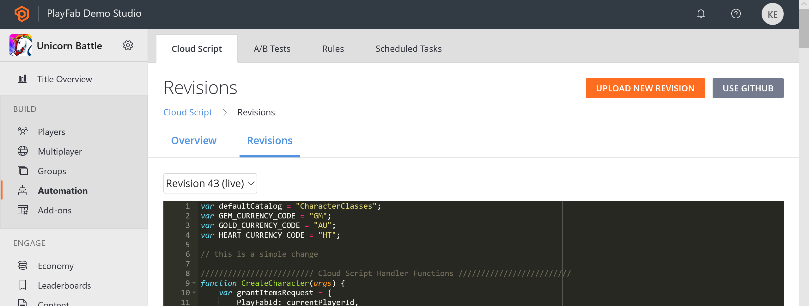
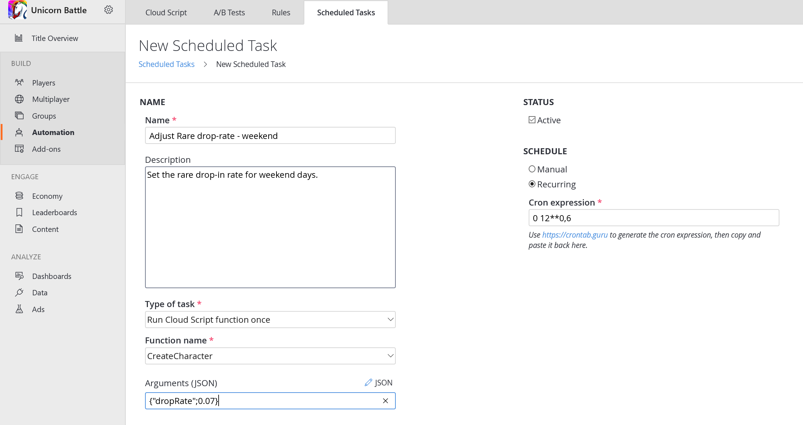
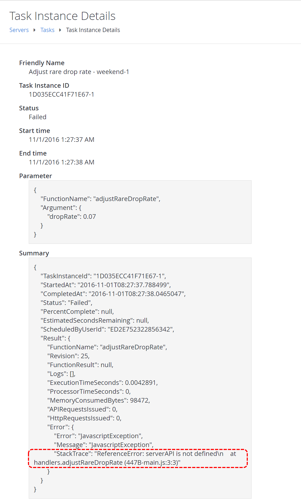

# Scheduled tasks quickstart

This quickstart shows you how to create a task that runs on a schedule. There are many game operation routines that can be automated using a scheduled task, such as:

- Modifying prices in a store according to the time of the day.
- Updating title data to reflect changes for a current event.
- Injecting virtual currencies into the game economy daily, etc.

In the example used in this quickstart, we'll show you how to modify a game variable called **rareDropRate** in the title data at 12:00 UTC, and only on weekend days.

## Step 1 - Prepare the CloudScript

In the **Game Manager**:

- Select **Automation** in the menu to the left.
- On the **CloudScript Revisions** tab add a new CloudScript function called `adjustRareDropRate` with a simple call to the `SetTitleData` API as shown in the code snippet and image below.

> [!NOTE]
> For the sharp-eyed, don’t worry - there’s a bug in there on purpose. Make sure you deploy the new revision, so that it is live in your game.

You can learn more about using CloudScript in our [CloudScript quickstart](../cloudscript/quickstart.md), and in documentation for the method [ExecuteCloudScript](xref:titleid.playfabapi.com.client.server-sidecloudscript.executecloudscript).

```javascript
handlers.adjustRareDropRate = function(args) {
    // Tutorial demo CloudScript
    serverAPI.SetTitleData({
        "Key": "rareDropRate",
        "Value": args.dropRate
    });
}
```

  

## Step 2 - Create a scheduled task

Now select **Servers** from the menu to the left.

- Go to the **Scheduled Tasks** tab.
- Select **New Scheduled Task** on the upper-right corner of your screen.
- This will bring up the **Create Task** view.
- In the **Type of task** field, choose **Run a CloudScript function**.
- Below that, you’ll be able to pick a function from the currently deployed revision of CloudScript, and specify arguments to pass in.
- Choose the **adjustRareDropRate Handler** that you wrote in the previous step.

To set the schedule for this task:

- Select **On a schedule (UTC)** under the **SCHEDULE** header.
- A simple schedule builder lets you choose when the **Task** should run (every hour, day, week, etc).
- For this example, we would like an advanced schedule, where we can specify which days of the week to run the task.
- So select **CRON EXPRESSION**.

The highly customizable Cron Expression allows you to build a very complex schedule, though it’s important to note that we currently *only* allow schedules whose occurrences happen on 5-minute marks of the hour.

For example, you may specify a task to run on the 5th, 10th, 25th, or 50th minute of the hour, but you may *not* specify a task to run on the 3rd, 11th, or 46th minute of the hour.

If you'd like to learn more about Cron Expression, [crontab.guru](https://crontab.guru/) provides rich information and an interactive expression builder.

In this case, we want the task to run at 12:00 UTC on Saturdays and Sundays, which would be **00 12 * * 0,6**  (zero minutes past twelve o’clock, every Sunday and Saturday).

Finally, make sure you save the new task before moving on to the next step.

  

## Step 3 - Test the task

On the **Tasks** view (**Servers** -> **Tasks**), we can see that the next run of the newly created task is on the following *Saturday* - as expected.

So, if it’s currently *Tuesday*, then the next scheduled runtime would be *4 days away*. To test the task *now*, select the **Adjust rare drop rate** task and choose **RUN TASKS**.

  

## Step 4 - Check the results of the test run

Unfortunately, the task run has failed. Select the task instance to see what went wrong.

  

The **Task Instance Details** view provides diagnostic information on why the task failed.

In this case, it’s pointing out that the call to **serverAPI.SetTitleData** is incorrect. It should *really* be **server.SetTitleData** (for an explanation, see the **Intermediate: Calling the Server APIs** section of the [Writing Custom CloudScript](../cloudscript/writing-custom-cloudscript.md#intermediate-calling-the-server-apis) tutorial).

There is other important information on the **Task Instance Details** view as well - such as the start and end times, the function that was called, any arguments passed in, the full CloudScript execution result, and more.

  

## Step 5 - Test again (successfully)

Go ahead and fix the error we found in Step 4. The correct code snippet is shown below.

```javascript
handlers.adjustRareDropRate = function(args) {
    // Tutorial demo CloudScript
    server.SetTitleData({
        "Key": "rareDropRate",
        "Value": args.dropRate
    });
}
```

And now, repeating Step 3, your final test run is successful.

  

To confirm success:

- Select **Content** in the menu to the left.
- Go to the **Title Data** tab.
- Verify that the **Title Data** entry was actually set.


