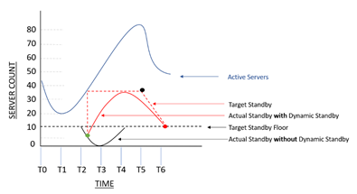
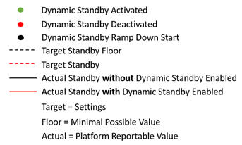

# Dynamic Standby

> [!IMPORTANT]
> This feature is currently in **Private Preview**.  
>
> It is provided to give you an early look at an upcoming feature, and to allow you to provide feedback while it is still in development. We will be making it broadly available to developers as soon as we can.

Dynamic Standby is an auto scaling enhancement that monitors standby server threshold levels and dynamically activates increased provisioning of game servers to meet demand at scale.

PlayFab’s Multiplayer Servers provides a bank of standby servers to support immediate fulfillment of requests for additional game servers in response to player demand. If the demand for additional servers grows faster than the time necessary to acquire and provision servers from the reserves, the pool of standby servers becomes depleted. The pool of available servers enter a “starvation” state and requests for game servers fail until additional servers can be provisioned. Dynamic Standby automatically activates increased provisioning of game servers to meet demand.

## Terminology

- **Target Standby** – A value set by the platform that specifies the target number of standby servers to have available to avoid standby pool starvation.
- **Target Standby Floor**– A game developer configurable measure representing the minimum floor quantity of servers kept idle to fulfill demand for new game servers.
- **Actual Standby** – The quantity of standby servers reported by the Multiplayer Servers platform where its values are distinct between when Dynamic Standby is enabled versus when Dynamic Standby is disabled.
- **Dynamic Standby Settings**– A game developer configurable programmatic object representing Dynamic Standby settings to avoid standby pool starvation.
- **Dynamic Standby Activated** – The point in time when the Multiplayer Servers platform starts allocating standby servers at a rate aligned with the dynamic Standby settings, overriding that target standby floor settings.
- **Dynamic Standby Deactivated** – The point in time when the Multiplayer Servers platform stops allocating standby servers at a rate aligned with the dynamic Standby settings, restoring the target standby floor settings.

## How It Works

As a Title developer, you specify a target standby floor value for the minimum number of standby servers. If the rate at which active servers are allocated grows rapidly, the actual standby servers may hit zero. If Dynamic Standby is enabled, an auto scaling heuristic will trigger and adjust the target standby value used by the platform to compensate for the rate of active server allocations.

To state this another way, if the number of available standby servers decreases at a rate that could lead to standby pool starvation, dynamic standby will increase the target number standby servers.

The following graphs show the difference of availability of servers when Dynamic Standby is enabled and it is disabled.

|                       |                       |
| --------------------- | --------------------- |
|  |  |

At time T2, even though the target standby floor setting is 10, the actual standby value reported by the platform is near zero because the rate at which active servers are allocated is too large for the number of standby servers. With Dynamic Standby enabled, the target standby is set to 20. This allows the standby pool to handle the request rate and rebuild to handle the additional growth in active servers.

### Calculating Dynamic Standby Targets

With Dynamic Standby enabled, the target standby is calculated for each threshold configured:

**IF** (Active Servers \> 1X Target Standby) **AND** ((Actual Standby /
Target Standby Floor) \< 0.50) **THEN**

Target Standby = 1.5 \* Target Standby

**IF** (Active Servers \> 1X Target Standby) **AND** ((Actual Standby /
Target Standby Floor) \< 0.25) **THEN**

Target Standby = 3.0 \* Target Standby

**IF** (Active Servers \> 1X Target Standby) **AND** ((Actual Standby /
Target Standby Floor) \< 0.005) **THEN**

Target Standby = 4.0 \* Target Standby

Revisiting figure \#1 above, the following table illustrates the target standby calculation inputs and its values:

| Time  | Active Server Count  | Active Server Allocation Rate   | Target Standby Floor | Actual Standby  |  Target Standby |
|---|---|---|---|---|---|
| T0 | 40 | >+40 servers per time T| 10 | 10 | 10 |
| T1 | 20 | -20 servers per time T | 10 | 10 | 10 |
| T2 | 30 | +10 servers per time T | 10 |  4 | 35 |
| T3 | 50 | +10 servers per time T | 10 |  1 | 40 |
| T4 | 70 | +20 servers per time T | 10 |  4 | 40 |
| T5 | 80 | +10 servers per time T | 10 | 10 | 40 |
| T6 | 50 | -30 servers per time T | 10 | 10 | 10 |

When Dynamic Standby is deactivated, there is a gradual ramp down of standby servers until the original standby floor is reached.

## Dynamic Standby Programmers Interface

The Dynamic Standby feature introduces a new object to the Multiplayer programming interface called `DynamicStandby`. The Dynamic Standby object is an optional property of the [BuildRegionParams](https://docs.microsoft.com/rest/api/playfab/multiplayer/multiplayerserver/updatebuildregions?view=playfab-rest#buildregionparams) object.

### DYNAMIC STANDBY SETTINGS OBJECT

The default settings of the objects’ properties are described in the following table.

| UI Name | Object Property Name | Required  | Type | Default | Description |
|---|---|---|---|---|---|
| Mode | Mode | Yes | Bool | Off | Switch that enables/disables adaptive standby settings |
| <strong>Ramp Down Seconds</strong> | RampDownSeconds | No | Int | 1800 | The time it takes to reduce target standby to configured floor value after auto-increase. Defaults to 30 minutes (i.e. 1800 seconds) |
| <strong>Thresholds</strong> | DynamicFloorMultiplierThresholds| No | List&lt;DynamicStandbyThreshold&gt; | 
{0.5,1.5},

{0.25,3},

{0.05,4}
 | The sorted list of thresholds and multipliers used to make the automatic Standby Server increase. |

### DYNAMIC STANDBY THRESHOLDS OBJECT

| UI Name | Name | Required  | Type | Default | Description |
|---|---|---|---|---|---|
| Threshold Percentage | TriggerThresholdPercentage | Yes | Double | 0 | The threshold for the ratio between current standby servers and the standby servers floor where the corresponding multiplier will be applied |
| Threshold Multiplier | Multiplier | Yes | Double | 1 | The value to multiple the standby floor value by when the corresponding threshold is hit |

## CREATE API  

You can The Dynamic Standby can be programmatically enabled by calling any of the following Multiplayer Server methods:  

1. Override [Update Build Regions](https://docs.microsoft.com/rest/api/playfab/multiplayer/multiplayerserver/updatebuildregions?view=playfab-rest)  
   *UPSERT: An operation that inserts rows into a database table (if they do not already exist) or updates them (if they do).*
2. [Create Build with Custom Container](https://docs.microsoft.com/rest/api/playfab/multiplayer/multiplayerserver/createbuildwithcustomcontainer?view=playfab-rest)
3. [Create Build with Managed Container](https://docs.microsoft.com/rest/api/playfab/multiplayer/multiplayerserver/createbuildwithmanagedcontainer?view=playfab-rest)

To enable Dynamic Standby programmatically, toggle the `Mode` property to ON. The `Mode` is the only required property of the Dynamic Standby Settings object. Its default value is **OFF**.

## UPDATE API

The Dynamic Standby can be programmatically edited by calling the Override [Update Build Regions](https://docs.microsoft.com/rest/api/playfab/multiplayer/multiplayerserver/updatebuildregions?view=playfab-rest) method.

The Dynamic Settings is an advance game server feature and editing the settings from its default values must be done with caution. Configuring Dynamic Standby requires editing properties of the Dynamic Standby object.
